# fTPM + Motherboard Serials Reset Guide.
## Tested on an Intel CPU and ASUS Motherboard

The day of me writing this guide, a corrupt, cash-grabbing corporation hellbent on spying on users that play their video games have forced some part of their user base to enable fTPMs in their Motherboard BIOS.

I am writing up a guide on how we would possibly be able to change our Motherboard serials so people can avoid being profiled as there have been multiple cases of developers, and other people abusing their access to user data, downplaying issues and spreading misinformation to suit their narratives.

### Warnings: 
- This is more effectively "Proof-of-Concept" to "it can be done"
- You will have to experiment, and figure out ways and adapt to your own Motherboard configurations.
- You will be reading this "guide" on your own risk.
- I am **not liable** for any damages you cause on your motherboard

## Prerequisites:
- Read/Write Access to our Motherboard’s BIOS/Flash chips 
> In my case, due to my motherboard being BIOS write protected, I will be using a [CH341A](https://github.com/bigbigmdm/CH341a_spi_programmer) with [flashrom](https://github.com/flashrom/flashrom),
- The SPI Flash Chips are likely to be in a SOIC-8 or WSON-8 package for CH341a.

- [American Megatrends’ Firmware Update Utility](https://www.ami.com/bios-uefi-utilities/)
> we will need this application to find out our motherboard’s Flash Chip Name (Example later).
- A hex editor, I personally use [HxD](https://mh-nexus.de/en/downloads.php?product=HxD20)
Optionally, [UEFITool](https://github.com/LongSoft/UEFITool)

- Always take backups of any files you are about to modify and flash!

## If you use a CH341A to flash your motherboard
- Make sure all power sources are removed. (This is important to make a connection to the SPI Chip as well)
- Hold the power button for 10 seconds after removing power sources to ensure no power remains in any components.

## The Process: 
### 1.  Find out our motherboard Name and Get its BIOS Update files from the manufacturer
- You can either type this command in a windows command line terminal 

`wmic baseboard get manufacturer, product`

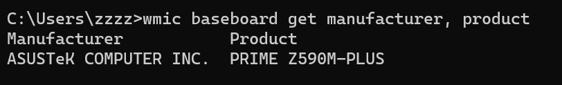

- Alternatively, you can use the windows start menu and type `msinfo` and run system information

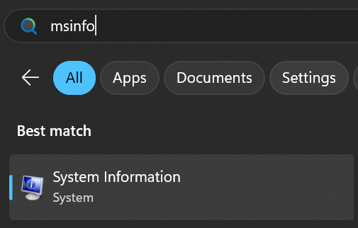
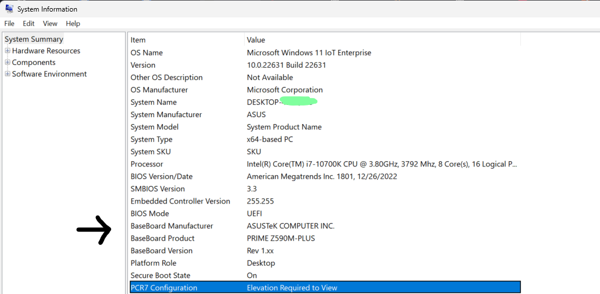

- For me, my motherboard is ASUS Z590M Prime Plus
- Our next step would be to download the stock BIOS from the manufacturer's website, this process will differ for you so I will not have any screenshots for it. 

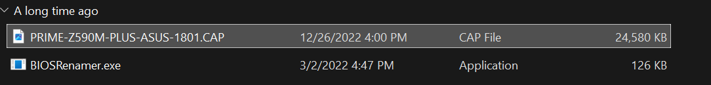

--- 

### 2. Now we will run AMI's APTIO V to get some information about our motherboard bios size and spi flash chips
 - In the previously downloaded zip file from American megatrends' website, navigate to
`Aptio_V_AMI_Firmware_Update_Utility.zip\afu\afuwin\64\AfuWin64.zip\AfuWin64\`
and extract the files

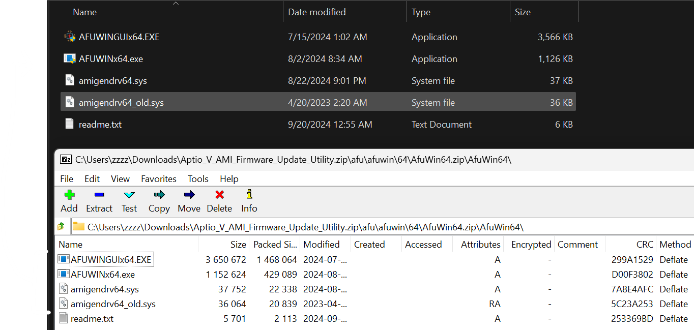

- Run `AFUWINGUIx64.EXE`: 

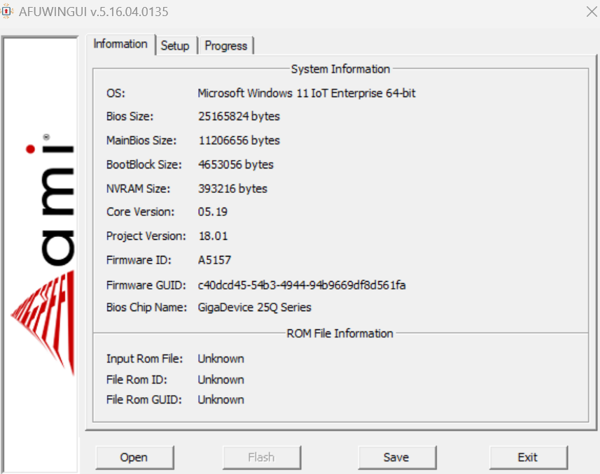

- Here we are presented with some information about our Motherboard BIOS, for me:

> BIOS Size: `25165824 Bytes`

> BIOS Chip Name:  `GigaDevice 25Q Series`

- We notice that the bios file we downloaded from the manufacturer is bigger than the BIOS Size displayed in AFU-Win-GUI,

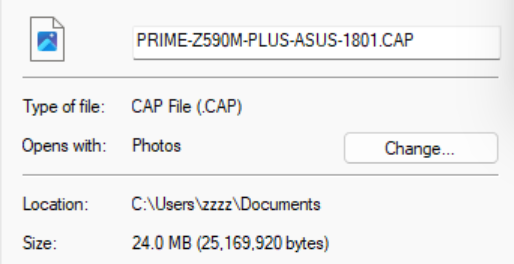

This is because the downloaded file is encapsulated with additional data, we can simply open the file in HXD and remove the first `0x1000` (4096) bytes
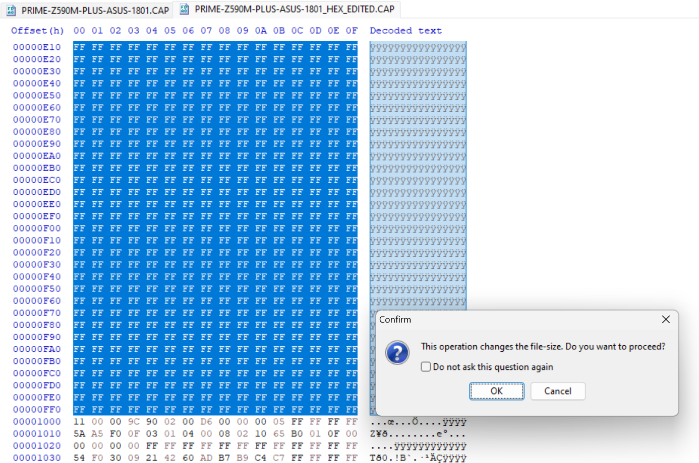
> I had other ways to verify this (CH341A), but you can check BIOS Size + 0x1000 =  25169920 (Size of encapsulated BIOS File)

- We can also use UEFI Tool to achieve the same

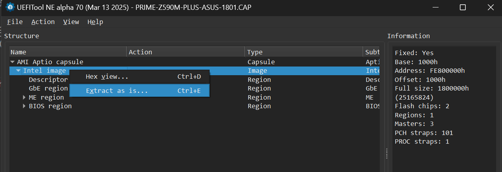
> In this screenshot, we can see the `Base : 1000h`, which is another way we can verify that the first 0x1000 bytes were just the capsule data. 

> Some motherboards will have a **major** size mismatch and will **not** have Capsule data. For these motherboards, you'll have to rely on a CH341a for **both** reading and writing the BIOS Flash memory.

- Now we have our vanilla BIOS files with no data on them.
- We will save these files as we will need them later.

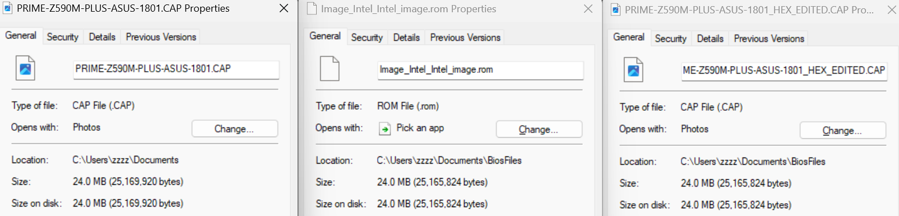

--- 

### 3. Read the BIOS Image off our Motherboards.
- Depending on how you've decided to approach Read/Write access to your motherboard, you will have to choose how you're going to read the bios files off you.

> AFU-Win-Gui Should work for almost everyone as motherboards don't usually implement read protections, only write protections.

> You can read the same data with the CH341A Spi flash programmer, but it will be scattered across multiple SPI Flash chips as sometimes these bios files are too big.

- Here's how we can read the BIOS File with AFU Win GUI

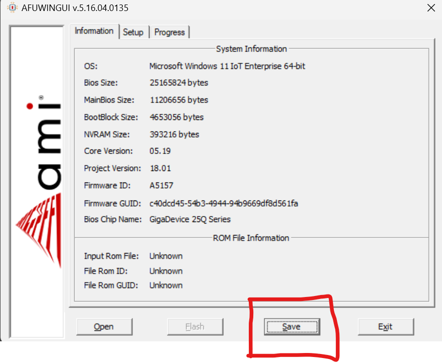
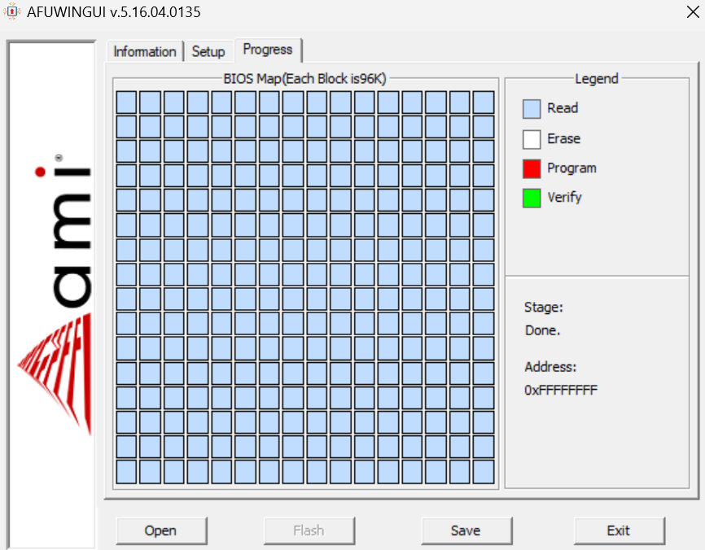

- We will further check our previously prepared "vanilla" files are valid: 

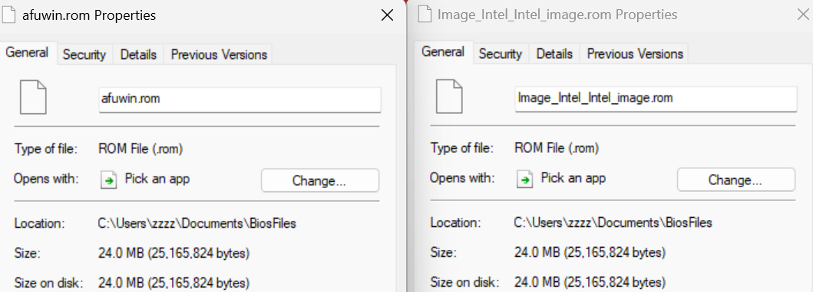

> We can see the files are exactly the same size, and when we compare them in HXD, the data is about the same.

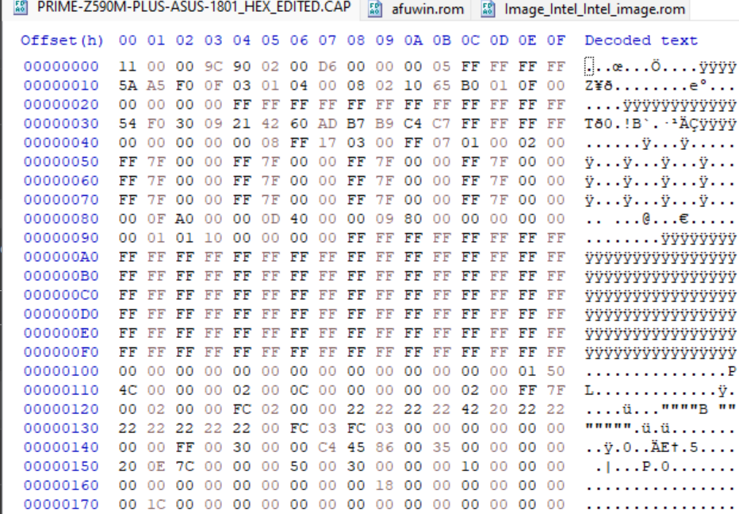
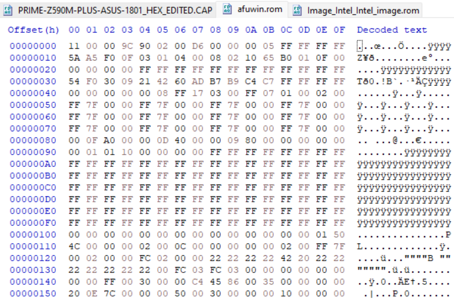

> If the data doesn't look the same we've made some mistake in our previous steps.

> Please do not continue if the data doesn't look identical at least for the first few hundred bytes.

---
### 4. Editing the vanilla BIOS Files
- Before we begin editing the vanilla bios files, let's get the original UUID/Serial Number from our machine.
- In a command line terminal, execute

`wmic csproduct get uuid`

`wmic baseboard get serialnumber`

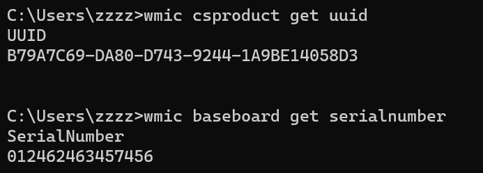

My serials (I set these specifically for this guide)

> UUID : B79A7C69-DA80-D743-9244-1A9BE14058D3

> SerialNumber : 012462463457456

- To search where these are located, we will have to look into the AFU-Win GUI dumped/saved bios.

- For my UUID, I will be searching this way :

- You can ask ChatGPT to represent each DWORD(4 bytes) or WORD (2 bytes) as raw bytes, Prompt: 

`Please convert DWORD B79A7C69 to Byte representation, little-endian`

-  UUID: B79A7C69-DA80-D743-9244-1A9BE14058D3
1. B79A7C69
2. DA80
3. D743
4. 9244
5. 1A9BE14058D3

> Search bytes will be : 
1. 69 7c 9a b7 (DWORD)
2. 80 da (WORD)
3. 43 d7 (WORD)
4. 92 44 (WORD - No change)
5. 1A 9B E1 40 58 D3 (6Bytes, no change) 
> Final Bytes : 69 7c 9a b7 80 da 43 d7 92 44 1A 9B E1 40 58 D3

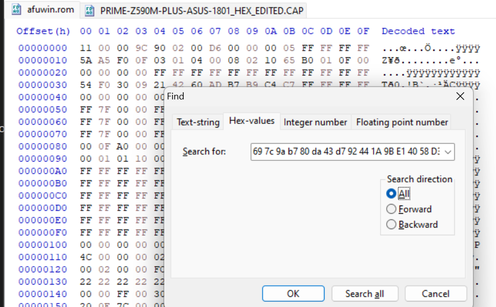

- That gives us two hits, the first hit leads us to a string `ASUSBKP$`, which can be interpreted as Asus Backup String

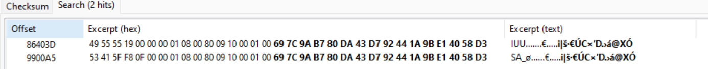
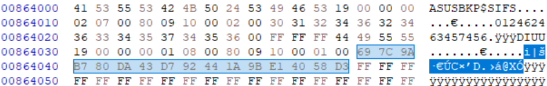

> We don't need to bother with any data differences here as these will be overwritten by your Motherboard Chipset on the first boot.

- The interesting one to us is at the address `0x9900A5`, Within the address range `0x99009C` to `0x9900CE` we see the UUID and Serial number along with a few other bytes
> Within the address range, **not** exactly the address range.
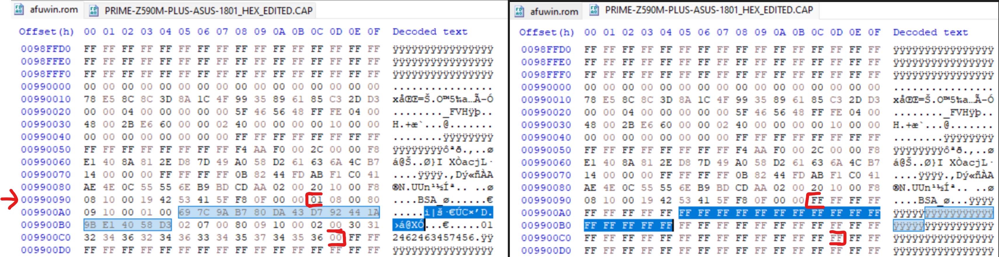

- We will now copy the bytes from the previous address range `0x99009C` to `0x9900CE` (these will vary for you) from the AFU Win Bios dump to our Vanilla BIOS dump.

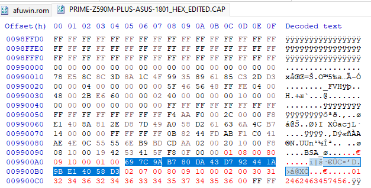

- We now edit the UUID in this address range `0x9900A5` to `0x9900B4` (16 Bytes)
- And edit the serial number as text in (Address range `0x9900BE` to `0x9900CC`) Byte `0x9900CD` = is the string terminator (0). 
- Save the file.

--- 
### 5. Flashing the Modified Vanilla BIOS
- If you don't have a write-protected bios, you might be able to write the Bios file from AFU-WIN-GUI itself, but this will likely **not work**, as we need to write all sections of your bios, but you are free to try.
- I personally never used APTIO V to read my read my bios flash chips because I'm on a write-protected Asus Motherboard.
it involved a lot of experimentation with the CH341 until I figured it out.

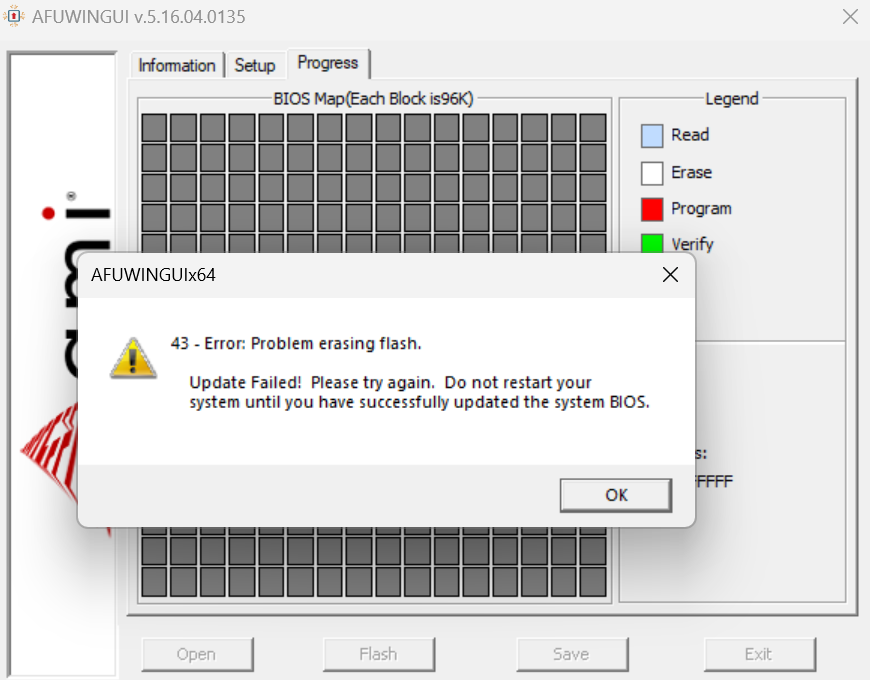

### - Here's where the CH341A comes in

- 1. Previously, we found that our motherboard had BIOS CHIP NAME : `GigaDevice 25Q Series` and looking at the motherboard physically, I was able to find this chip. 

Note that there is another spi flash chip right next to it, and that it was located right next to the Motherboard Chipset.

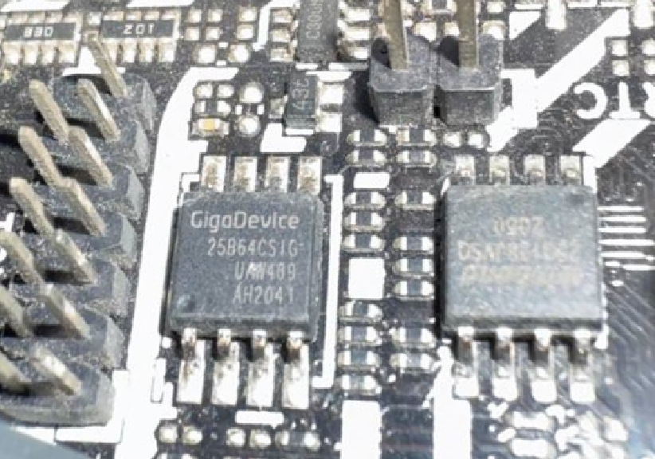
> This image is upside down.
- Here We see that the SPI Model is `Gigadevice 25B64CSIG`.
- Searching online, I was able to find it at mouser.sg, where the memory size was listed at `64Megabits`
> 1 Byte = 8 bits, so 64 megabits = 8 megabytes.

Considering the above logic, our bios file appears way too big for this one SPI Chip.
Trying to read or write with flashrom confirms the chip is in fact 8 megabytes

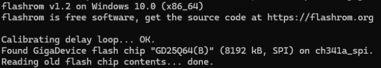

- I read the flash chip with flashrom, and in fact, the file is almost identical to the first

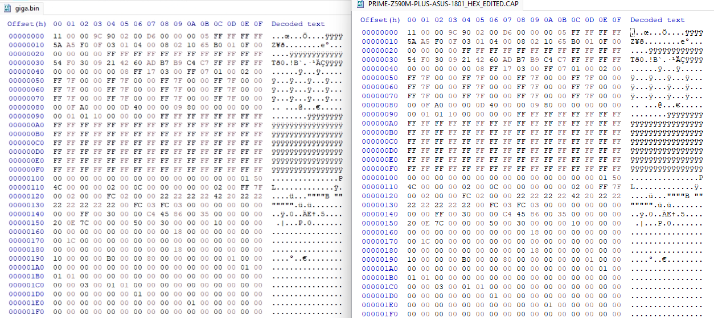

> and coincidentally (sarcasm), the other SPI Flash chip right next to my 8MB Gigadevice flash chip is a Winbond 25 Series, 16 Megabyte chip:

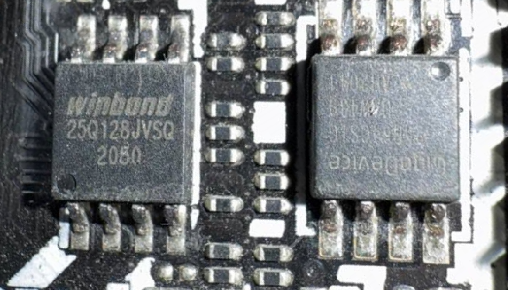
> Simple math with the text on the winbond chip can tell us : 128 / 8 = 16 (MB)

> 8 + 16 = 24 (Size of the BIOS Roms we've dumped and downloaded off of the manufacturer and AFU-WIN-GUI)

- 2. Here's the part where we split the 24MB Prepared file into an 8MB / 16 MB Split to flash with flashrom onto our SPI Flash chips

- I go to the address `0x800000` and **move** (remove from source) all the bytes into a new file called "giga.bin" 
> because we know the first 8MB are from the gigadevice spi chip

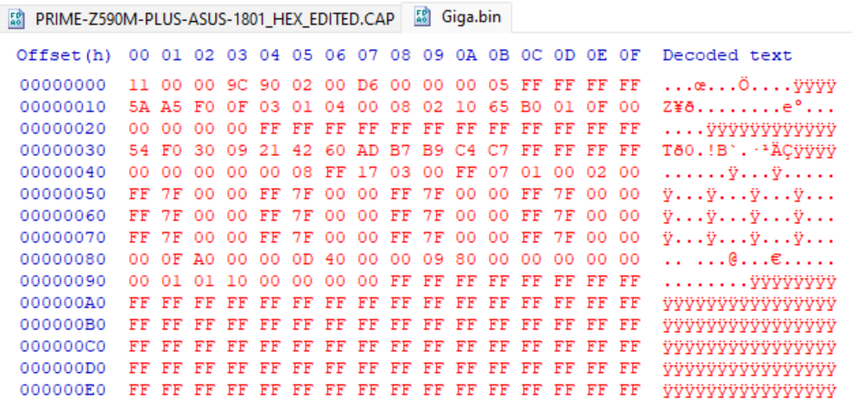

- We see at this point our remaining file appears to start with these bytes

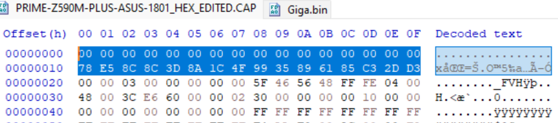
> These bytes should be common (only the first `0x20` bytes) across different motherboards.
- If I read data from the winbond chip we can confirm it was in fact 16MB and the files match up

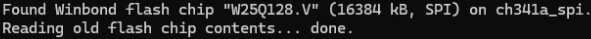
> Data match screenshot not attached as it's not required.

- At this point we've covered the 24 Megabytes we originally had from the BIOS ROM, it is time for me to edit and flash the files. 
- For my Motherboard I'm aware that the gigadevice SPI Chip contains the Ethernet MAC Address at `0x1000`, So I'll be editing that too (default values manufacturers might have are `88 88 88 88 87 88`)
- Making the CH341 soic8 connection might be hard, but you'll get better with practice. I am able to connect  to it with a high success rate 
### The flashing process with flashrom looks a bit like this:
> this is from my run from before I changed serials to write this "guide"

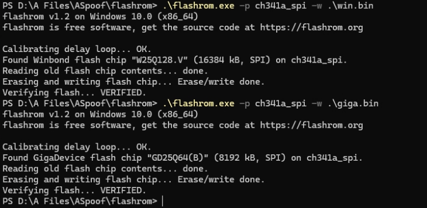

### Here's how you're supposed to connect your CH341:
[Youtube Tutorial](https://www.youtube.com/watch?v=4qX2zihB6UE)

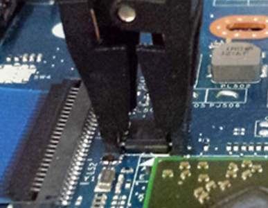

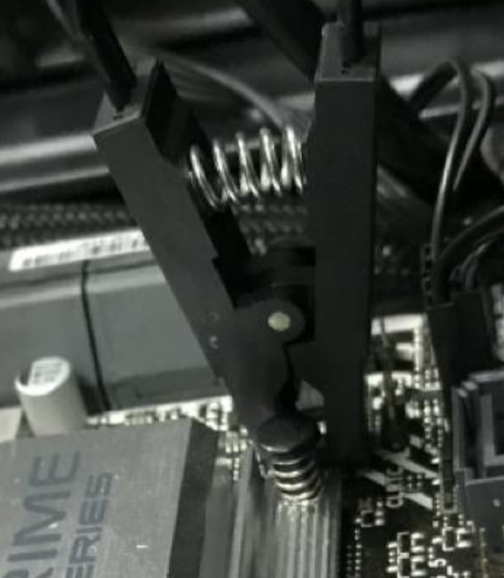
> Sorry for the low quality images, you're better off looking at Youtube/WinRaid/BIOS Modding Forums to learn this better.

# Here are my serials before flashing:

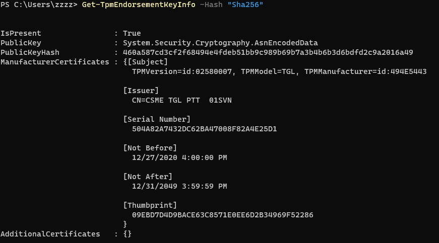

> UUID/Serial Number were already shown earlier

# After Flash : 

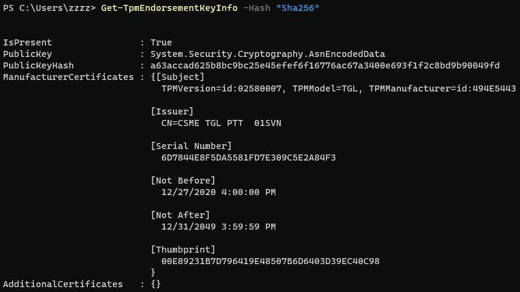
> These changes are permanent, unless you change them again. 
> As earlier stated, I've tested this with [tpm-mmio](https://github.com/synctop/tpm-mmio) as well due to someone asking me to do it.

# TL;DR, what did we do here?
- We just flashed stock firmware for our BIOS with UUID/Serial numbers that we put in manually

- Why is a ch341 needed? Because a normal BIOS flash/update will not overwrite all sections (which is why you normally maintain serials after bios updates), while here our goal is to destory all data.

- This has been used since 2022 and there have been no issues regarding its functionality.